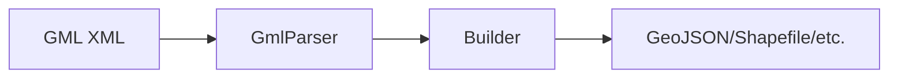

# Dokumentation: s-gml

Willkommen zur **s-gml** Dokumentation! Hier findest du alle Ressourcen um mit der Bibliothek zu arbeiten und beizutragen.

## 📚 Dokumentations-Übersicht

### 🏗️ **Architektur**
- **[System-Überblick](./architecture/system-overview.md)** - Vollständige System-Architektur mit Mermaid-Diagrammen
  - Eingabe → Parser → Builder → Output Datenfluss
  - Komponenten-Hierarchie
  - Performance-Charakteristiken
  - Erweiterbarkeit

- **[Klassen-Diagramm](./architecture/class-diagram.md)** - Detaillierte Klassen-Hierarchie
  - Haupt-Klassen (`GmlParser`, `StreamingGmlParser`)
  - Builder-Interface und Implementierungen
  - Type-Hierarchie (GML-Geometrien, Features, Coverages)
  - WCS-Klassen
  - Performance-Utilities

### 👨‍💻 **Entwickler-Guides**
- **[Contributing Guide](./guides/CONTRIBUTING.md)** - Wie man zu s-gml beiträgt
  - Development Setup
  - Coding Standards
  - Neuen Builder hinzufügen (Schritt-für-Schritt)
  - Neue Geometrie-Typen unterstützen
  - Tests schreiben
  - Pull Request Process
  - Release Process

- **[TSDoc-Beispiele](./guides/tsdoc-examples.md)** - TSDoc-Kommentare für wichtige Klassen
  - GmlParser vollständig dokumentiert
  - StreamingGmlParser Beispiele
  - Builder Interface Dokumentation
  - Performance-Klassen
  - WCS-Klassen
  - Best Practices für TSDoc

### 📖 **API-Dokumentation**
- **[API Reference](./api/index.html)** *(generiert)* - Vollständige API-Dokumentation mit TypeDoc
  - Wird mit `pnpm run docs:generate` generiert
  - Öffne `docs/api/index.html` im Browser

## 🚀 Quick Start

### Dokumentation ansehen

```bash
# API-Dokumentation generieren
pnpm run docs:generate

# API-Dokumentation im Browser öffnen
open docs/api/index.html

# Oder mit lokalem Server
pnpm run docs:serve
# Öffne http://localhost:8080 im Browser
```

### Dokumentation neu generieren

```bash
# Alte API-Docs löschen und neu generieren
pnpm run docs:build
```

## 📂 Verzeichnis-Struktur

```
docs/
├── README.md                       # Diese Datei
├── architecture/                   # Architektur-Dokumentation
│   ├── system-overview.md         # System-Architektur + Diagramme
│   └── class-diagram.md           # Klassen-Hierarchie + UML
├── guides/                         # Entwickler-Guides
│   ├── CONTRIBUTING.md            # Contribution Guide
│   └── tsdoc-examples.md          # TSDoc-Kommentare Beispiele
└── api/                            # TypeDoc API-Docs (generiert)
    ├── index.html                 # Entry Point
    ├── classes/                   # Klassen-Dokumentation
    ├── interfaces/                # Interface-Dokumentation
    ├── types/                     # Type-Dokumentation
    └── functions/                 # Funktions-Dokumentation
```

## 📝 Verfügbare Scripts

| Command | Beschreibung |
|---------|--------------|
| `pnpm run docs:generate` | Generiert API-Dokumentation mit TypeDoc |
| `pnpm run docs:serve` | Startet lokalen Server für API-Docs (Port 8080) |
| `pnpm run docs:clean` | Löscht generierte API-Dokumentation |
| `pnpm run docs:build` | Löscht alte Docs und generiert neu |

## 🎯 Für Contributor

Wenn du zur Dokumentation beitragen möchtest:

1. **Architektur-Diagramme aktualisieren**
   - Bearbeite Markdown-Dateien in `docs/architecture/`
   - Verwende Mermaid-Syntax für Diagramme
   - Teste Diagramme mit [Mermaid Live Editor](https://mermaid.live/)

2. **Guides erweitern**
   - Füge neue Guides zu `docs/guides/` hinzu
   - Halte dich an Markdown-Best-Practices
   - Füge Code-Beispiele hinzu

3. **TSDoc-Kommentare hinzufügen**
   - Siehe `docs/guides/tsdoc-examples.md` für Beispiele
   - Füge TSDoc-Kommentare direkt zum Source-Code hinzu
   - Generiere API-Docs neu mit `pnpm run docs:generate`

4. **API-Dokumentation**
   - Wird automatisch aus TSDoc-Kommentaren generiert
   - Konfiguration in `typedoc.json`
   - Niemals manuell editieren!

## 📌 Wichtige Links

- **Haupt-README**: [/README.md](../README.md)
- **Contributing**: [/docs/guides/CONTRIBUTING.md](./guides/CONTRIBUTING.md)
- **GitHub Issues**: https://github.com/pt9912/s-gml/issues
- **NPM Package**: https://www.npmjs.com/package/@npm9912/s-gml

## 🔍 Dokumentations-Kategorien

### Für Nutzer
- [Haupt-README](../README.md) - Installation, Usage, Features
- [API Reference](./api/index.html) - Vollständige API-Dokumentation

### Für Contributor
- [System-Architektur](./architecture/system-overview.md) - System-Design verstehen
- [Klassen-Diagramm](./architecture/class-diagram.md) - Code-Struktur verstehen
- [Contributing Guide](./guides/CONTRIBUTING.md) - Beitragen lernen
- [TSDoc-Beispiele](./guides/tsdoc-examples.md) - Dokumentation schreiben

### Für Maintainer
- [Contributing Guide - Release Process](./guides/CONTRIBUTING.md#release-process)
- TypeDoc-Konfiguration: `typedoc.json`
- Build-Scripts: `package.json`

## 🛠️ Technologie

Die Dokumentation verwendet:
- **[TypeDoc](https://typedoc.org/)** - API-Dokumentation aus TypeScript-Code
- **[Mermaid](https://mermaid.js.org/)** - Diagramme in Markdown
- **Markdown** - Alle Guides und Architektur-Docs

## 📊 Mermaid-Diagramme

Alle Architektur-Diagramme verwenden Mermaid-Syntax. Sie werden automatisch von GitHub und vielen Markdown-Viewern gerendert.

**Beispiel:**


**Online-Editor:** https://mermaid.live/

## 💡 Tipps

1. **Markdown-Viewer**: Verwende einen Markdown-Viewer mit Mermaid-Support
   - VS Code Extension: "Markdown Preview Mermaid Support"
   - Browser Extension: "Mermaid Diagrams"

2. **Lokale API-Docs**: Nach `pnpm run docs:generate` öffne `docs/api/index.html`

3. **Suche**: Nutze die Suche in TypeDoc API-Docs (Top-Right)

4. **Navigation**: TypeDoc generiert automatische Navigation nach Kategorien

## 📞 Fragen?

Wenn du Fragen zur Dokumentation hast:
- **Issues**: [GitHub Issues](https://github.com/pt9912/s-gml/issues) mit Label `documentation`
- **Discussions**: [GitHub Discussions](https://github.com/pt9912/s-gml/discussions)

---

**Viel Erfolg mit s-gml!** 🚀
