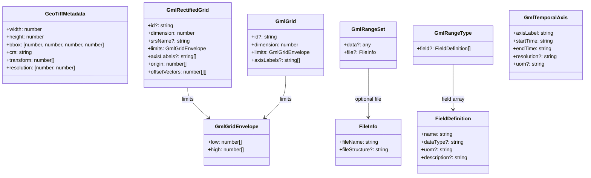
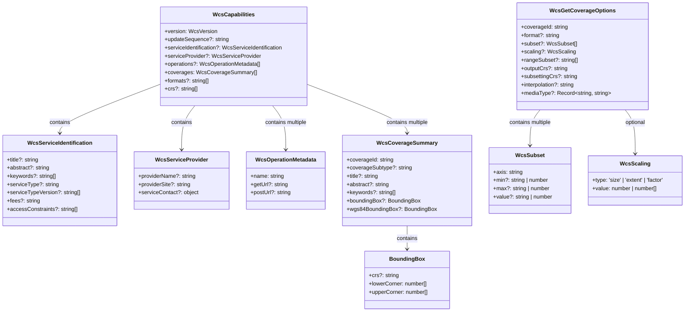

# Klassen-Diagramm: s-gml

## Haupt-Klassen-Hierarchie

```mermaid
classDiagram
    %% Core Parser Classes
    class GmlParserBase["GmlParser Base"] {
        -builder: Builder
        +constructor(targetFormat: string | Builder, builderFactory: BuilderFactory)
        +parse(xml: string): Promise~Geometry | Feature | FeatureCollection~
        +parseFromUrl(url: string): Promise~Geometry | Feature | FeatureCollection~
        +convert(xml: string, options: GmlConvertOptions): Promise~string~
        +convertFromUrl(url: string, options: GmlConvertOptions): Promise~string~
        +convertGeometry(gmlObject, options): Promise~string~
        -parseGml(doc, version): GmlGeometry | GmlFeature
        -parsePoint(element, version): GmlPoint
        -parseLineString(element, version): GmlLineString
        -parsePolygon(element, version): GmlPolygon
        -parseFeatureCollection(element, version): GmlFeatureCollection
        -toGeoJson(gmlObject): Geometry | Feature
    }

    class GmlParserNode["GmlParser (Node Entry)"] {
        +constructor(targetFormat: string | Builder)
    }

    class GmlParserBrowser["GmlParser (Browser Entry)"] {
        +constructor(targetFormat: string | Builder)
    }

    class StreamingGmlParser {
        -gmlParser: GmlParser
        -featureCount: number
        +constructor(options?: StreamingParserOptions)
        +parseStream(stream: ReadableStream | NodeJS.ReadableStream): Promise~void~
        +parseFile(filePath: string): Promise~void~
        +parseFromUrl(url: string): Promise~void~
        +getFeatureCount(): number
        +on(event: string, callback: Function): this
        -emitError(error: Error): void
    }

    class BrowserBuilderResolver["Browser Builder Resolver"] {
        +getBuilder(format: string): Builder
    }

    class NodeBuilderResolver["Node Builder Resolver"] {
        +getBuilder(format: string): Builder
    }

    %% Builder Interface and Implementations
    class Builder~TGeometry, TFeature, TFeatureCollection~ {
        <<interface>>
        +buildPoint(gml: GmlPoint): TGeometry
        +buildLineString(gml: GmlLineString): TGeometry
        +buildPolygon(gml: GmlPolygon): TGeometry
        +buildMultiPoint(gml: GmlMultiPoint): TGeometry
        +buildMultiLineString(gml: GmlMultiLineString): TGeometry
        +buildMultiPolygon(gml: GmlMultiPolygon): TGeometry
        +buildLinearRing(gml: GmlLinearRing): TGeometry
        +buildEnvelope(gml: GmlEnvelope): TFeature
        +buildBox(gml: GmlBox): TFeature
        +buildCurve(gml: GmlCurve): TGeometry
        +buildSurface(gml: GmlSurface): TGeometry
        +buildRectifiedGridCoverage(gml): TFeature
        +buildGridCoverage(gml): TFeature
        +buildReferenceableGridCoverage(gml): TFeature
        +buildMultiPointCoverage(gml): TFeature
        +buildFeature(gml: GmlFeature): TFeature
        +buildFeatureCollection(gml: GmlFeatureCollection): TFeatureCollection
    }

    class GeoJsonBuilder {
        +buildPoint(gml): Geometry
        +buildLineString(gml): Geometry
        +buildPolygon(gml): Geometry
        +buildFeature(gml): Feature
        +buildFeatureCollection(gml): FeatureCollection
    }

    class ShapefileBuilder {
        +buildPoint(gml): Geometry
        +buildFeature(gml): Feature
        +buildFeatureCollection(gml): FeatureCollection
        +toZip(fc, options): Promise~Blob | ArrayBuffer | string~
        +getWgs84Prj(): string
        +getWebMercatorPrj(): string
    }

    class GeoPackageBuilder {
        +buildPoint(gml): Geometry
        +buildFeature(gml): Feature
        +buildFeatureCollection(gml): FeatureCollection
        +toGeoPackage(fc, options): Promise~Buffer~
    }

    class FlatGeobufBuilder {
        +buildPoint(gml): Geometry
        +buildFeature(gml): Feature
        +buildFeatureCollection(gml): FeatureCollection
        +toFlatGeobuf(fc): Uint8Array
    }

    class CsvBuilder {
        +buildPoint(gml): string
        +buildLineString(gml): string
        +buildPolygon(gml): string
        +buildFeature(gml): CsvRow
        +buildFeatureCollection(gml): string
    }

    class KmlBuilder {
        +buildPoint(gml): string
        +buildLineString(gml): string
        +buildPolygon(gml): string
        +buildFeature(gml): string
        +buildFeatureCollection(gml): string
    }

    class WktBuilder {
        +buildPoint(gml): string
        +buildLineString(gml): string
        +buildPolygon(gml): string
        +buildFeature(gml): WktFeature
        +buildFeatureCollection(gml): WktCollection
    }

    class CisJsonBuilder {
        +buildRectifiedGridCoverage(gml): object
        +buildGridCoverage(gml): object
        +buildFeature(gml): object
        +buildFeatureCollection(gml): object
    }

    class CoverageJsonBuilder {
        +buildRectifiedGridCoverage(gml): object
        +buildGridCoverage(gml): object
        +buildFeature(gml): object
        +buildFeatureCollection(gml): object
    }

    %% WCS Classes
    class WcsRequestBuilder {
        -baseUrl: string
        -version: WcsVersion
        +constructor(baseUrl: string, version: WcsVersion)
        +buildGetCoverageUrl(options): string
        +buildGetCoverageXml(options): string
        -buildSubsetParam(subset): string
        -buildScalingParam(scaling): string
    }

    class WcsCapabilitiesParser {
        +parse(xml: string): WcsCapabilities
        -parseServiceIdentification(node): WcsServiceIdentification
        -parseCoverageSummary(node): WcsCoverageSummary
        -parseOperations(node): WcsOperationMetadata[]
    }

    %% Coverage Generator
    class CoverageGenerator {
        +generate(coverage, prettyPrint): string
        +generateRectifiedGridCoverage(coverage): string
        +generateGridCoverage(coverage): string
        +generateReferenceableGridCoverage(coverage): string
        +generateMultiPointCoverage(coverage): string
        -generateDomainSet(domainSet): string
        -generateRangeSet(rangeSet): string
        -generateRangeType(rangeType): string
    }

    %% Performance Classes
    class PerformanceMonitor {
        -startTime: number
        -endTime: number
        -featureCount: number
        -totalBytes: number
        -metrics: Map~string, number~
        +start(): void
        +stop(): void
        +addFeature(bytes: number): void
        +addMetric(name, value): void
        +getMetric(name): number
        +getReport(): PerformanceReport
    }

    class BatchProcessor~T, R~ {
        -batchSize: number
        -processor: Function
        -batches: T[][]
        -results: R[]
        +constructor(batchSize, processor)
        +add(item: T): void
        +getResults(): Promise~R[]~
        -processBatch(batch): Promise~R~
    }

    %% OWS Exception Handling
    class OwsExceptionError {
        +report: OwsExceptionReport
        +constructor(report: OwsExceptionReport)
        +getAllMessages(): string
    }

    class OwsExceptionReport {
        +version: string
        +language?: string
        +exceptions: OwsException[]
    }

    class OwsException {
        +exceptionCode: string
        +exceptionText?: string[]
        +locator?: string
    }

    %% Relationships
    GmlParserBase --> Builder : uses
    GmlParserBase <|-- GmlParserNode : extends
    GmlParserBase <|-- GmlParserBrowser : extends
    GmlParserNode ..> NodeBuilderResolver : uses
    GmlParserBrowser ..> BrowserBuilderResolver : uses
    StreamingGmlParser --> Builder : uses

    Builder <|.. GeoJsonBuilder : implements
    Builder <|.. ShapefileBuilder : implements
    Builder <|.. GeoPackageBuilder : implements
    Builder <|.. FlatGeobufBuilder : implements
    Builder <|.. CsvBuilder : implements
    Builder <|.. KmlBuilder : implements
    Builder <|.. WktBuilder : implements
    Builder <|.. CisJsonBuilder : implements
    Builder <|.. CoverageJsonBuilder : implements

    GmlParserNode ..> WcsRequestBuilder : optional use
    GmlParserNode ..> CoverageGenerator : optional use
    GmlParserNode ..> PerformanceMonitor : optional use
    GmlParserBrowser ..> WcsRequestBuilder : optional use
    GmlParserBrowser ..> CoverageGenerator : optional use
    GmlParserBrowser ..> PerformanceMonitor : optional use
    StreamingGmlParser ..> BatchProcessor : uses
    StreamingGmlParser ..> PerformanceMonitor : optional use

    OwsExceptionError --> OwsExceptionReport : contains
    OwsExceptionReport --> OwsException : contains multiple

    GmlParserBase ..> OwsExceptionError : may throw
    StreamingGmlParser ..> OwsExceptionError : may throw
```

**Browser-spezifische Hinweise:**
- `GmlParser (Browser Entry)` wird über `@npm9912/s-gml/browser` oder die `browser`-Condition des Paket-Roots aufgelöst.
- `ShapefileBuilder` und `GeoPackageBuilder` sind im Browser-Build nur als Guard-Exporte verfügbar und werfen bei Nutzung einen Laufzeitfehler.
- `FlatGeobufBuilder` bleibt im Browser-Build verfügbar.
- `StreamingGmlParser.parseFile()` ist im Browser-Build nicht verfügbar.

## Type-Hierarchie

```mermaid
classDiagram
    %% GML Geometry Types
    class GmlPoint {
        +type: 'Point'
        +coordinates: number[]
        +srsName?: string
        +version: GmlVersion
    }

    class GmlLineString {
        +type: 'LineString'
        +coordinates: number[][]
        +srsName?: string
        +version: GmlVersion
    }

    class GmlPolygon {
        +type: 'Polygon'
        +coordinates: number[][][]
        +srsName?: string
        +version: GmlVersion
    }

    class GmlLinearRing {
        +type: 'LinearRing'
        +coordinates: number[][]
        +srsName?: string
        +version: GmlVersion
    }

    class GmlEnvelope {
        +type: 'Envelope'
        +bbox: [number, number, number, number]
        +srsName?: string
        +version: GmlVersion
    }

    class GmlBox {
        +type: 'Box'
        +coordinates: [number, number, number, number]
        +srsName?: string
        +version: GmlVersion
    }

    class GmlCurve {
        +type: 'Curve'
        +coordinates: number[][]
        +srsName?: string
        +version: GmlVersion
    }

    class GmlSurface {
        +type: 'Surface'
        +patches: GmlPolygon[]
        +srsName?: string
        +version: GmlVersion
    }

    class GmlMultiPoint {
        +type: 'MultiPoint'
        +coordinates: number[][]
        +srsName?: string
        +version: GmlVersion
    }

    class GmlMultiLineString {
        +type: 'MultiLineString'
        +coordinates: number[][][]
        +srsName?: string
        +version: GmlVersion
    }

    class GmlMultiPolygon {
        +type: 'MultiPolygon'
        +coordinates: number[][][][]
        +srsName?: string
        +version: GmlVersion
    }

    %% Coverage Types
    class GmlRectifiedGridCoverage {
        +type: 'RectifiedGridCoverage'
        +id?: string
        +boundedBy?: GmlEnvelope
        +domainSet: GmlRectifiedGrid
        +rangeSet: GmlRangeSet
        +rangeType?: GmlRangeType
        +temporal?: GmlTemporalAxis
        +version: GmlVersion
    }

    class GmlGridCoverage {
        +type: 'GridCoverage'
        +id?: string
        +boundedBy?: GmlEnvelope
        +domainSet: GmlGrid
        +rangeSet: GmlRangeSet
        +rangeType?: GmlRangeType
        +temporal?: GmlTemporalAxis
        +version: GmlVersion
    }

    class GmlReferenceableGridCoverage {
        +type: 'ReferenceableGridCoverage'
        +id?: string
        +boundedBy?: GmlEnvelope
        +domainSet: GmlGrid
        +rangeSet: GmlRangeSet
        +rangeType?: GmlRangeType
        +temporal?: GmlTemporalAxis
        +version: GmlVersion
    }

    class GmlMultiPointCoverage {
        +type: 'MultiPointCoverage'
        +id?: string
        +boundedBy?: GmlEnvelope
        +domainSet: GmlMultiPoint
        +rangeSet: GmlRangeSet
        +rangeType?: GmlRangeType
        +version: GmlVersion
    }

    class GmlFeature {
        +id?: string
        +geometry: GmlGeometry
        +properties: Record~string, any~
        +version: GmlVersion
        +boundedBy?: GmlEnvelope
    }

    class GmlFeatureCollection {
        +type: 'FeatureCollection'
        +features: GmlFeature[]
        +version: GmlVersion
        +bounds?: GmlEnvelope
    }

    %% Type Unions
    class GmlGeometry {
        <<union type>>
        GmlPoint | GmlLineString | GmlPolygon |
        GmlLinearRing | GmlEnvelope | GmlBox |
        GmlCurve | GmlSurface |
        GmlMultiPoint | GmlMultiLineString | GmlMultiPolygon
    }

    class GmlCoverage {
        <<union type>>
        GmlRectifiedGridCoverage | GmlGridCoverage |
        GmlReferenceableGridCoverage | GmlMultiPointCoverage
    }

    %% Relationships
    GmlFeature --> GmlGeometry : contains
    GmlFeatureCollection --> GmlFeature : contains multiple
    GmlSurface --> GmlPolygon : contains patches
    GmlRectifiedGridCoverage --> GmlEnvelope : optional boundedBy
    GmlGridCoverage --> GmlEnvelope : optional boundedBy
    GmlMultiPointCoverage --> GmlMultiPoint : domainSet
```

## Utility-Klassen

```mermaid
classDiagram
    class GeoTiffMetadata {
        +width: number
        +height: number
        +bbox: [number, number, number, number]
        +crs: string
        +transform: number[]
        +resolution: [number, number]
    }

    class GmlRectifiedGrid {
        +id?: string
        +dimension: number
        +srsName?: string
        +limits: GmlGridEnvelope
        +axisLabels?: string[]
        +origin: number[]
        +offsetVectors: number[][]
    }

    class GmlGrid {
        +id?: string
        +dimension: number
        +limits: GmlGridEnvelope
        +axisLabels?: string[]
    }

    class GmlGridEnvelope {
        +low: number[]
        +high: number[]
    }

    class GmlRangeSet {
        +data?: any
        +file?: FileInfo
    }

    class FileInfo {
        +fileName: string
        +fileStructure?: string
    }

    class GmlRangeType {
        +field?: FieldDefinition[]
    }

    class FieldDefinition {
        +name: string
        +dataType?: string
        +uom?: string
        +description?: string
    }

    class GmlTemporalAxis {
        +axisLabel: string
        +startTime: string
        +endTime: string
        +resolution?: string
        +uom?: string
    }

    %% Relationships
    GmlRectifiedGrid --> GmlGridEnvelope : limits
    GmlGrid --> GmlGridEnvelope : limits
    GmlRangeSet --> FileInfo : optional file
    GmlRangeType --> FieldDefinition : field array
```

## WCS Type-Hierarchie

```mermaid
classDiagram
    class WcsCapabilities {
        +version: WcsVersion
        +updateSequence?: string
        +serviceIdentification?: WcsServiceIdentification
        +serviceProvider?: WcsServiceProvider
        +operations?: WcsOperationMetadata[]
        +coverages: WcsCoverageSummary[]
        +formats?: string[]
        +crs?: string[]
    }

    class WcsServiceIdentification {
        +title?: string
        +abstract?: string
        +keywords?: string[]
        +serviceType?: string
        +serviceTypeVersion?: string[]
        +fees?: string
        +accessConstraints?: string[]
    }

    class WcsServiceProvider {
        +providerName?: string
        +providerSite?: string
        +serviceContact?: object
    }

    class WcsOperationMetadata {
        +name: string
        +getUrl?: string
        +postUrl?: string
    }

    class WcsCoverageSummary {
        +coverageId: string
        +coverageSubtype?: string
        +title?: string
        +abstract?: string
        +keywords?: string[]
        +boundingBox?: BoundingBox
        +wgs84BoundingBox?: BoundingBox
    }

    class BoundingBox {
        +crs?: string
        +lowerCorner: number[]
        +upperCorner: number[]
    }

    class WcsGetCoverageOptions {
        +coverageId: string
        +format?: string
        +subset?: WcsSubset[]
        +scaling?: WcsScaling
        +rangeSubset?: string[]
        +outputCrs?: string
        +subsettingCrs?: string
        +interpolation?: string
        +mediaType?: Record~string, string~
    }

    class WcsSubset {
        +axis: string
        +min?: string | number
        +max?: string | number
        +value?: string | number
    }

    class WcsScaling {
        +type: 'size' | 'extent' | 'factor'
        +value: number | number[]
    }

    %% Relationships
    WcsCapabilities --> WcsServiceIdentification : contains
    WcsCapabilities --> WcsServiceProvider : contains
    WcsCapabilities --> WcsOperationMetadata : contains multiple
    WcsCapabilities --> WcsCoverageSummary : contains multiple
    WcsCoverageSummary --> BoundingBox : contains
    WcsGetCoverageOptions --> WcsSubset : contains multiple
    WcsGetCoverageOptions --> WcsScaling : optional
```

## Interaktions-Matrix

| Klasse | Verwendet | Produziert | Wird verwendet von |
|--------|-----------|------------|-------------------|
| `GmlParser Base` | `Builder`, `XMLParser` | `Geometry`, `Feature`, `FeatureCollection` | Node- und Browser-Parser |
| `GmlParser (Node Entry)` | Node Builder Resolver | `Geometry`, `Feature`, `FeatureCollection` | User Code, CLI |
| `GmlParser (Browser Entry)` | Browser Builder Resolver | `Geometry`, `Feature`, `FeatureCollection` | Browser Bundles, Browser Provider |
| `StreamingGmlParser` | `Builder`, `BatchProcessor` | Event-Stream | User Code (große Dateien) |
| `GeoJsonBuilder` | - | GeoJSON Objects | `GmlParser`, `StreamingGmlParser` |
| `ShapefileBuilder` | `@mapbox/shp-write` | Shapefile ZIP | Node-Parser, Helper Functions, Browser Guard |
| `GeoPackageBuilder` | `@ngageoint/geopackage` | .gpkg Binary | Node-Parser, Helper Functions, Browser Guard |
| `FlatGeobufBuilder` | `flatgeobuf` | .fgb Binary | Node- und Browser-Parser, Helper Functions |
| `CsvBuilder` | - | CSV String | `GmlParser` |
| `KmlBuilder` | - | KML XML String | `GmlParser` |
| `WktBuilder` | - | WKT Strings | `GmlParser` |
| `WcsRequestBuilder` | - | WCS URLs/XML | User Code, WCS Clients |
| `WcsCapabilitiesParser` | `XMLParser` | `WcsCapabilities` | User Code, WCS Clients |
| `CoverageGenerator` | - | WCS 2.0 XML | User Code, Coverage Tools |
| `PerformanceMonitor` | - | `PerformanceReport` | `GmlParser`, `StreamingGmlParser` |
| `BatchProcessor` | - | Processed Results | `StreamingGmlParser` |
| `OwsExceptionError` | `OwsExceptionReport` | Error | Thrown by Parsers |

## Zusammenfassung

Die Klassen-Architektur von **s-gml** folgt klaren Prinzipien:

1. **Separation of Concerns**: Parser, Builder, Browser-Entry und Utilities sind getrennt
2. **Open/Closed Principle**: Neue Builder können hinzugefügt werden ohne bestehenden Code zu ändern
3. **Dependency Inversion**: Parser hängt von `Builder` Interface und Builder-Resolvern ab, nicht von konkreten Implementierungen
4. **Single Responsibility**: Jede Klasse hat eine klare, einzelne Aufgabe
5. **Type Safety**: Vollständige TypeScript-Typisierung aller Schnittstellen
