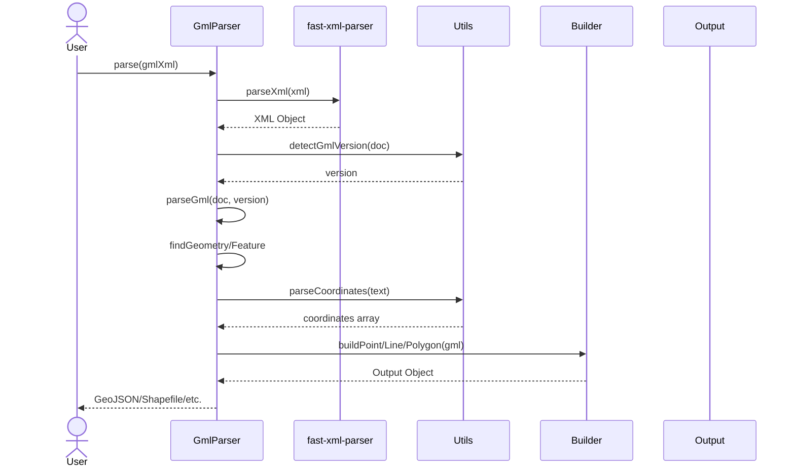
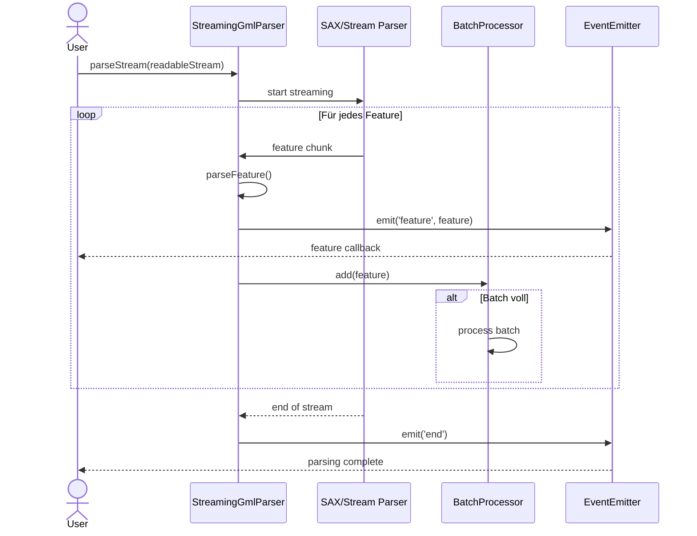
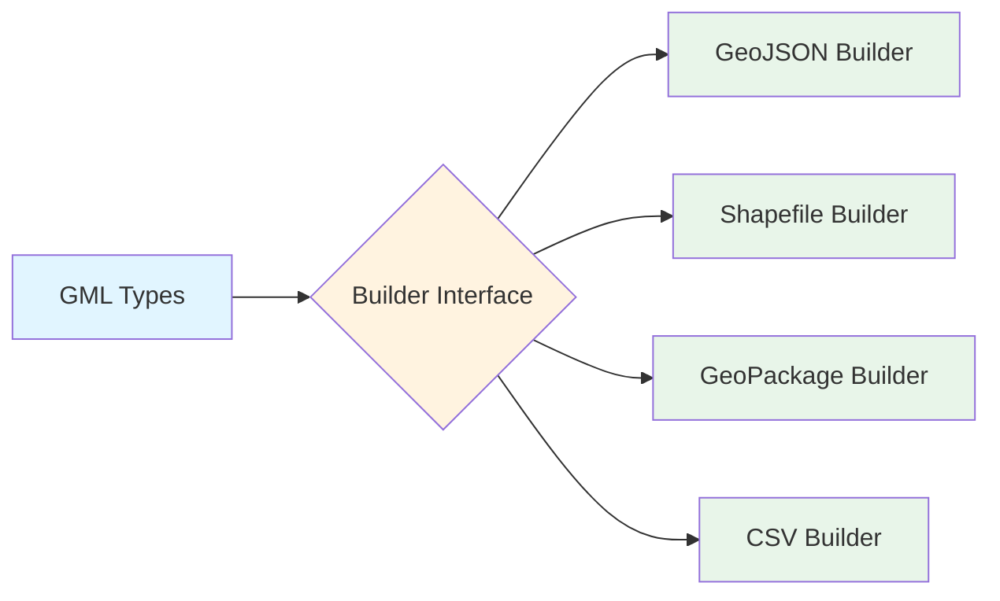
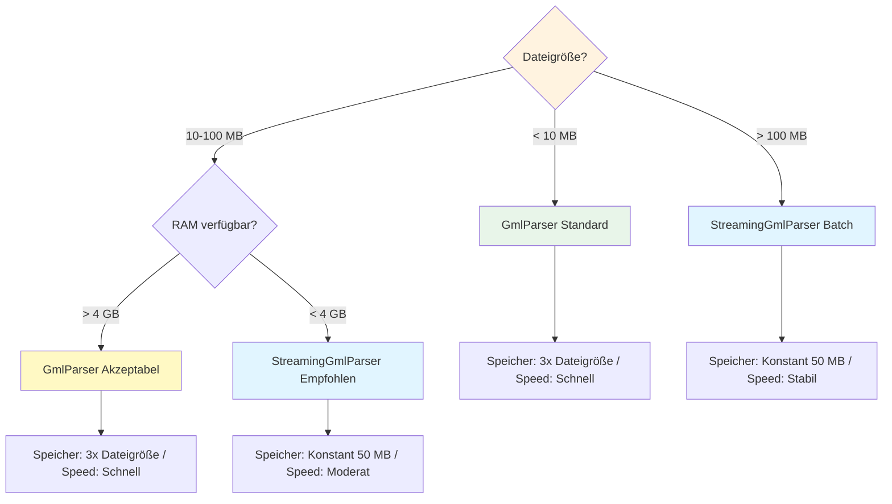
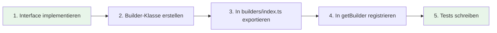

# System-Architektur: s-gml

## Überblick

**s-gml** ist eine TypeScript-Bibliothek zur Verarbeitung von GML (Geography Markup Language) Dokumenten. Das System ist modular aufgebaut und folgt dem Builder-Pattern für flexible Output-Formate.

## System-Architektur

```mermaid
graph TB
    subgraph "Eingabe-Layer"
        XML[GML XML Document]
        URL[URL/Remote Source]
        File[Lokale Datei]
    end

    subgraph "Parser-Layer"
        GmlParser[GmlParser]
        StreamingParser[StreamingGmlParser]
        XMLParser[fast-xml-parser]
        Utils[Utilities]
    end

    subgraph "Transformation-Layer"
        Builder[Builder Interface]
        GeoJsonBuilder[GeoJsonBuilder]
        ShapefileBuilder[ShapefileBuilder]
        GeoPackageBuilder[GeoPackageBuilder]
        FlatGeobufBuilder[FlatGeobufBuilder]
        CsvBuilder[CsvBuilder]
        KmlBuilder[KmlBuilder]
        WktBuilder[WktBuilder]
        CisJsonBuilder[CisJsonBuilder]
        CoverageJsonBuilder[CoverageJsonBuilder]
    end

    subgraph "Spezial-Module"
        WCS[WCS Module]
        Coverage[Coverage Generator]
        Performance[Performance Module]
        Validator[Validator]
        OWS[OWS Exception Handler]
    end

    subgraph "Output-Layer"
        GeoJSON[GeoJSON]
        Shapefile[Shapefile ZIP]
        GeoPackage[GeoPackage .gpkg]
        FlatGeobuf[FlatGeobuf .fgb]
        CSV[CSV + WKT]
        KML[KML Google Earth]
        WKT[Well-Known Text]
        CisJson[CIS JSON]
        CoverageJson[CoverageJSON]
    end

    %% Datenfluss
    XML --> GmlParser
    URL --> GmlParser
    File --> StreamingParser

    GmlParser --> XMLParser
    StreamingParser --> XMLParser
    XMLParser --> Utils

    GmlParser --> Builder
    StreamingParser --> Builder

    Builder --> GeoJsonBuilder
    Builder --> ShapefileBuilder
    Builder --> GeoPackageBuilder
    Builder --> FlatGeobufBuilder
    Builder --> CsvBuilder
    Builder --> KmlBuilder
    Builder --> WktBuilder
    Builder --> CisJsonBuilder
    Builder --> CoverageJsonBuilder

    GeoJsonBuilder --> GeoJSON
    ShapefileBuilder --> Shapefile
    GeoPackageBuilder --> GeoPackage
    FlatGeobufBuilder --> FlatGeobuf
    CsvBuilder --> CSV
    KmlBuilder --> KML
    WktBuilder --> WKT
    CisJsonBuilder --> CisJson
    CoverageJsonBuilder --> CoverageJson

    GmlParser -.-> WCS
    GmlParser -.-> Coverage
    GmlParser -.-> Performance
    GmlParser -.-> Validator
    GmlParser -.-> OWS

    classDef inputClass fill:#e1f5ff,stroke:#01579b,stroke-width:2px
    classDef parserClass fill:#fff3e0,stroke:#e65100,stroke-width:2px
    classDef builderClass fill:#f3e5f5,stroke:#4a148c,stroke-width:2px
    classDef outputClass fill:#e8f5e9,stroke:#1b5e20,stroke-width:2px
    classDef specialClass fill:#fff9c4,stroke:#f57f17,stroke-width:2px

    class XML,URL,File inputClass
    class GmlParser,StreamingParser,XMLParser,Utils parserClass
    class Builder,GeoJsonBuilder,ShapefileBuilder,GeoPackageBuilder,FlatGeobufBuilder,CsvBuilder,KmlBuilder,WktBuilder,CisJsonBuilder,CoverageJsonBuilder builderClass
    class GeoJSON,Shapefile,GeoPackage,FlatGeobuf,CSV,KML,WKT,CisJson,CoverageJson outputClass
    class WCS,Coverage,Performance,Validator,OWS specialClass
```



## Komponenten-Übersicht

### 1. **Eingabe-Layer**
- **GML XML Dokumente**: Direkte Verarbeitung von GML 2.1.2, 3.0, 3.1, 3.2, 3.3
- **URL/Remote Sources**: Laden und Parsen von Remote-GML-Dateien (z.B. WFS GetFeature)
- **Lokale Dateien**: Streaming-Verarbeitung für große Dateien

### 2. **Parser-Layer**
| Komponente | Zweck | Verwendung |
|------------|-------|------------|
| `GmlParser` | Haupt-Parser-Klasse | Standard-Parsing für < 100 MB Dateien |
| `StreamingGmlParser` | Event-basierter Streaming-Parser | Große Dateien (> 100 MB) |
| `fast-xml-parser` | XML → JavaScript Object Konvertierung | Intern verwendet |
| `Utils` | Koordinaten-Parsing, Versions-Detection | Helper-Funktionen |

### 3. **Transformation-Layer (Builder Pattern)**
Alle Builder implementieren das `Builder<TGeometry, TFeature, TFeatureCollection>` Interface:

```typescript
interface Builder<TGeometry, TFeature, TFeatureCollection> {
  buildPoint(gml: GmlPoint): TGeometry;
  buildLineString(gml: GmlLineString): TGeometry;
  buildPolygon(gml: GmlPolygon): TGeometry;
  // ... weitere Geometrie-Methoden
  buildFeature(gml: GmlFeature): TFeature;
  buildFeatureCollection(gml: GmlFeatureCollection): TFeatureCollection;
}
```

**Verfügbare Builder:**
- **GeoJsonBuilder** *(Standard)*: GeoJSON RFC 7946
- **ShapefileBuilder**: ESRI Shapefile (ZIP mit .shp, .shx, .dbf, .prj)
- **GeoPackageBuilder**: OGC GeoPackage (SQLite)
- **FlatGeobufBuilder**: Cloud-optimiertes Binärformat
- **CsvBuilder**: CSV mit WKT-Geometrien
- **KmlBuilder**: Google Earth KML 2.2
- **WktBuilder**: Well-Known Text
- **CisJsonBuilder**: OGC Coverage Implementation Schema JSON
- **CoverageJsonBuilder**: OGC CoverageJSON

### 4. **Spezial-Module**

#### **WCS Module** (`src/wcs/`)
- **WcsRequestBuilder**: Generiert WCS GetCoverage URLs und POST-XML
- **WcsCapabilitiesParser**: Parst GetCapabilities Responses (WCS 1.0 - 2.0.1)

#### **Coverage Generator** (`src/generators/`)
- Generiert WCS 2.0 XML aus Coverage-Objekten
- Unterstützt RectifiedGrid, Grid, ReferenceableGrid, MultiPoint Coverages
- Multi-band RangeType und Time-series Support

#### **Performance Module** (`src/performance.ts`)
- **PerformanceMonitor**: Throughput, Memory, Custom Metrics
- **BatchProcessor**: Batch-Verarbeitung für DB-Inserts
- **Memory Optimizations**: String Interning, Array Pooling, Caching

#### **Validator** (`src/validator.*.ts`)
- XSD-Validierung gegen offizielle GML-Schemata
- Plattform-spezifische Implementierungen (Node.js, Browser)

#### **OWS Exception Handler** (`src/ows-exception.ts`)
- Automatische Erkennung von WFS/WCS Exception Reports
- Strukturiertes Error Handling

### 5. **Output-Layer**
| Format | Dateiendung | Verwendung | Vorteil |
|--------|-------------|------------|---------|
| GeoJSON | `.json` | Web-Mapping, APIs | Standard, weit verbreitet |
| Shapefile | `.zip` | GIS-Software (QGIS, ArcGIS) | Desktop-GIS kompatibel |
| GeoPackage | `.gpkg` | OGC Standard, SQLite-basiert | Moderner GIS-Standard |
| FlatGeobuf | `.fgb` | Cloud-Storage, Streaming | Sehr performant |
| CSV | `.csv` | Tabellenkalkulation, Datenbanken | Einfach, universell |
| KML | `.kml` | Google Earth/Maps | Visualisierung |
| WKT | `.txt` | PostGIS, Datenbanken | SQL-freundlich |
| CIS JSON | `.json` | Coverage-Daten (OGC) | Grid-Coverage Standard |
| CoverageJSON | `.json` | Coverage-Daten (Web) | Web-optimiert |

## Design-Patterns

### Builder Pattern
- **Zweck**: Flexible Transformation von GML → verschiedene Output-Formate
- **Vorteil**: Neue Formate können einfach durch Implementation des `Builder` Interface hinzugefügt werden
- **Verwendung**:
  ```typescript
  const parser = new GmlParser('shapefile'); // oder new GmlParser(new CustomBuilder())
  const output = await parser.parse(gmlXml);
  ```

### Strategy Pattern
- **Zweck**: Austauschbare Parser-Strategien (Standard vs. Streaming)
- **Vorteil**: Optimale Performance je nach Dateigröße
- **Verwendung**:
  ```typescript
  // Standard: < 100 MB
  const parser = new GmlParser();

  // Streaming: > 100 MB
  const streamingParser = new StreamingGmlParser({ batchSize: 100 });
  ```

### Factory Pattern
- **Zweck**: Zentrale Builder-Erstellung via `getBuilder(format)`
- **Vorteil**: Vereinfachte API, konsistente Builder-Instanziierung
- **Verwendung**:
  ```typescript
  const builder = getBuilder('csv'); // Gibt CsvBuilder zurück
  ```

## Datenfluss-Diagramme

### Standard-Parsing-Flow



### Streaming-Parsing-Flow



### Builder-Transformation-Flow



**Transformation Details:**
- **GML Types**: `GmlGeometry`, `GmlFeature`, `GmlFeatureCollection`
- **GeoJSON Builder**: `buildPoint()`, `buildFeature()` → GeoJSON
- **Shapefile Builder**: `buildPoint()`, `toZip()` → Shapefile ZIP
- **GeoPackage Builder**: `buildFeature()`, `toGeoPackage()` → .gpkg
- **CSV Builder**: `buildPoint()` → WKT String → CSV

## Performance-Charakteristiken

### Parser-Auswahl-Entscheidungsbaum



## Erweiterbarkeit

### Neuen Builder hinzufügen



**Beispiel:**
```typescript
// 1. Interface implementieren
class MyCustomBuilder implements Builder<string, string, string> {
  buildPoint(gml: GmlPoint): string {
    return `CUSTOM_POINT(${gml.coordinates.join(',')})`;
  }
  // ... alle weiteren Methoden
}

// 2. Exportieren
export { MyCustomBuilder } from './builders/my-custom.js';

// 3. Registrieren
function getBuilder(format: string): Builder {
  if (format === 'custom') return new MyCustomBuilder();
  // ...
}

// 4. Verwenden
const parser = new GmlParser('custom');
const result = await parser.parse(gml); // String-Output
```

## Technologie-Stack

| Kategorie | Technologie | Version | Zweck |
|-----------|-------------|---------|-------|
| **Sprache** | TypeScript | 5.3+ | Type-Safety, moderne Features |
| **XML Parser** | fast-xml-parser | 4.5+ | XML → Object Konvertierung |
| **Validator** | xmllint-wasm | 5.0+ | XSD-Validierung (Browser-kompatibel) |
| **Shapefile** | @mapbox/shp-write | 0.4+ | Shapefile-Generierung |
| **GeoPackage** | @ngageoint/geopackage | 4.2+ | GeoPackage-Format |
| **FlatGeobuf** | flatgeobuf | 4.3+ | Binär-Format für Cloud |
| **CLI** | commander | 11.0+ | Command-Line Interface |
| **Build** | Rollup | 4.9+ | ESM + CJS + CLI Bundles |
| **Tests** | Jest | 29.6+ | Unit & Integration Tests |
| **Package Manager** | pnpm | 8.0+ | Schnelle, disk-effiziente Installs |

## Deployment-Szenarien

### 1. **NPM Package** (Library)
```bash
pnpm install @npm9912/s-gml
```
- Verwendung: Node.js + Browser (ESM/CJS)
- Bundle-Größe: ~400 KB (minified)

### 2. **CLI-Tool** (Command-Line)
```bash
npx @npm9912/s-gml parse input.gml --output output.geojson
```
- Verwendung: Lokale Verarbeitung, Batch-Scripts
- Platform: Node.js ≥ 22

### 3. **Docker Container**
```bash
docker run --rm -v $(pwd):/data s-gml-cli parse /data/input.gml
```
- Verwendung: CI/CD, Server-seitige Verarbeitung
- Isolation: Keine Abhängigkeiten erforderlich

## Zusammenfassung

**s-gml** ist eine hochflexible, performante GML-Parser-Bibliothek mit:
- ✅ Modularer Architektur (Builder Pattern)
- ✅ 9 Output-Formaten
- ✅ Streaming-Support für große Dateien
- ✅ WCS/WFS-Integration
- ✅ Performance-Optimierungen (Caching, Pooling, Batching)
- ✅ Vollständiger TypeScript Type-Safety
- ✅ CLI + Library + Docker Deployment

Die Architektur ermöglicht einfache Erweiterungen durch neue Builder-Implementierungen und bleibt dabei wartbar durch klare Separation of Concerns.
